## 1. Johdanto (tavoite, rajaus, aineistot)

Tämän analyysin tavoite on arvioida kolmen kunnan (Lapua, Seinäjoki, Kauhava) vuoden 2024 tilinpäätösaineiston perusteella kuntatalouden tilaa, tunnistaa **rahankäytön priorisoinnin ja holtittomuuden riskisignaaleja** sekä kuvata mahdollisia seurauksia **vain niiltä osin kuin ne seuraavat suoraan tilinpäätöksissä esitetystä datasta ja tekstistä**.

Rajaus:
- Analyysi perustuu ainoastaan annettuihin, koneellisesti tuotettuihin tilinpäätösdokumentteihin (Markdown + sivukuvat) sekä toimitettuun kuntalain tekstiin.
- Mitään lukua ei arvioida, pyöristetä tai oleteta. Jos jokin tarvittava tieto puuttuu tai on epäselvä, se merkitään **“Ei löydy aineistosta”**.

Käytetyt aineistot (asiakirjat):
- **Lapua**: `out/lapua_2024/Lapua-Tilinpaatos-2024.md` ja sivukuvat `out/lapua_2024/work/page_images/*` (käytetyt sivut: 20, 27, 31).  
  - [Lapua, `out/lapua_2024/work/page_images/page_0021.png` (printed page 20), "TALOUSTIEDOT" + tekstikappale lainamäärästä]  
  - [Lapua, `out/lapua_2024/work/page_images/page_0028.png` (printed page 27), "TULOSLASKELMA JA SEN TUNNUSLUVUT"]  
  - [Lapua, `out/lapua_2024/work/page_images/page_0032.png` (printed page 31), "RAHOITUSLASKELMA" + "RAHOITUSLASKELMAN TUNNUSLUVUT"]
- **Seinäjoki**: `out/seinajoki_2024/Seinäjoki-Tilinpaatos-2024.md` ja sivukuvat `out/seinajoki_2024/work/page_images/*` (käytetyt sivut: 20, 50, 56, 59).  
  - [Seinäjoki, `out/seinajoki_2024/Seinäjoki-Tilinpaatos-2024.md`, Page 22, kohdat sopeutustoimista ja talouden vahvistamisesta]  
  - [Seinäjoki, `out/seinajoki_2024/Seinäjoki-Tilinpaatos-2024.md`, Page 23, kohdat kestävyysvajeesta ja tavoitteista]  
  - [Seinäjoki, `out/seinajoki_2024/work/page_images/page_0053.png` (printed page 50), "TULOSLASKELMA (ulkoinen)"]  
  - [Seinäjoki, `out/seinajoki_2024/work/page_images/page_0059.png` (printed page 56), "RAHOITUSLASKELMA (ulkoinen)" + "RAHOITUSLASKELMAN TUNNUSLUVUT"]  
  - [Seinäjoki, `out/seinajoki_2024/work/page_images/page_0062.png` (printed page 59), "TASEEN TUNNUSLUVUT"]
- **Kauhava**: `out/kauhava_2024/Kauhava-Tilinpaatos-2024.md` ja sivukuvat `out/kauhava_2024/work/page_images/*` (käytetyt sivut: 22, 29, 32, 34).  
  - [Kauhava, `out/kauhava_2024/Kauhava-Tilinpaatos-2024.md`, Page 24, "Arvio todennäköisestä tulevasta kehityksestä" (investointiohjelma, lainakanta, korkotaso)]  
  - [Kauhava, `out/kauhava_2024/work/page_images/page_0030.png` (printed page 29/157), "TULOSLASKELMA JA SEN TUNNUSLUVUT"]  
  - [Kauhava, `out/kauhava_2024/work/page_images/page_0033.png` (printed page 32/157), "RAHOITUSLASKELMA JA SEN TUNNUSLUVUT" + "RAHOITUSLASKELMAN TUNNUSLUVUT"]  
  - [Kauhava, `out/kauhava_2024/work/page_images/page_0035.png` (printed page 34/157), "TASE JA SEN TUNNUSLUVUT" + "TASEEN TUNNUSLUVUT"]
- **Kuntalaki**: `F:\-DEV-\22.Kuntalaki\kuntalaki_410-2015_FULL.md` (käytetyt pykälät: 110 §, 113 §, 115 §, 118 §).  
  - [Kuntalaki, `kuntalaki_410-2015_FULL.md`, 110 §, L2393-L2405]  
  - [Kuntalaki, `kuntalaki_410-2015_FULL.md`, 113 §, L2427-L2436]  
  - [Kuntalaki, `kuntalaki_410-2015_FULL.md`, 115 §, L2445-L2451]  
  - [Kuntalaki, `kuntalaki_410-2015_FULL.md`, 118 §, L2461-L2490]

Tallennuspolku:
- Tämä analyysi tallennetaan kansioon `F:\-DEV-\PDF_Parser\Kunta-analyysi` (tämä tiedosto).

---

## 2. Metodologia ja datan tuotanto (poimintatapa, validointi, rajoitteet)

### 2.1 Poimintatapa (yhtenäinen ja lähteistetty)

Poimin jokaisesta kunnasta ensisijaisesti samat “ydintaulukot”, jotta vertailu pysyy määritelmiltään yhdenmukaisena:
- **Tuloslaskelma ja sen tunnusluvut**: Toimintakate, vuosikate, tilikauden tulos ja tilikauden ylijäämä/alijäämä.
- **Rahoituslaskelma ja sen tunnusluvut**: Investointimenot, rahavarojen muutos, rahavarat, lainakannan muutokset (lainan lisäys/vähennys) sekä kassan riittävyys.
- **Taseen tunnusluvut**: Lainakanta 31.12. ja €/asukas (jos esitetty).

Kaikki luvut on poimittu **suoraan sivukuvista** (page_images), jolloin vuosien sarakejärjestys on yksiselitteinen.

### 2.2 Sisäinen ristiintarkastus (konsistenssitarkistus)

Tein kunnittain ristiintarkastuksen vähintään seuraaville:
- Vuosikate tuloslaskelmassa = vuosikate rahoituslaskelmassa (sama vuosi, sama yksikkö 1 000 €).  
  - Lapua: 7 502 (tuloslaskelma) ja 7 502 (rahoituslaskelma), molemmat tilinp. 2024 / 1 000 €. [Lapua, `out/lapua_2024/work/page_images/page_0028.png`, "Vuosikate"] [Lapua, `out/lapua_2024/work/page_images/page_0032.png`, "Vuosikate"]  
  - Kauhava: 9 552 ja 9 552, molemmat 2024 / 1 000 €. [Kauhava, `out/kauhava_2024/work/page_images/page_0030.png`, "Vuosikate"] [Kauhava, `out/kauhava_2024/work/page_images/page_0033.png`, "Vuosikate"]  
  - Seinäjoki: 18 033 ja 18 033, molemmat 2024 / 1 000 €. [Seinäjoki, `out/seinajoki_2024/work/page_images/page_0053.png`, "Vuosikate"] [Seinäjoki, `out/seinajoki_2024/work/page_images/page_0059.png`, "Vuosikate"]

Jos ristiriita olisi löytynyt, se olisi raportoitu tässä näkyvästi “ristiriita”-merkinnällä. Tällä poiminnalla ydinarvojen (v. 2024 vuosikate) osalta ristiriitaa ei jäänyt.

### 2.3 Rajoitteet (mitä tämä ei voi todistaa)

- Tilinpäätösdatan tulkinta on rajattu siihen, mitä asiakirjat sanovat. Esimerkiksi investointien “tarpeellisuutta” tai “hyötyä” ei voi arvioida tästä aineistosta ilman hankekohtaisia päätös- ja toteumatietoja.  
- Toimialakohtaisia kustannuksia (esim. sivistys, tekninen, kulttuuri) ei tässä analyysissä poimittu erikseen. Jos halutaan aidosti “rahankäytön priorisointi toimialoittain”, aineistosta on toimitettava (tai osoitettava) selkeä tehtäväalue-/toimialueraportointi ja siihen liittyvät taulukot (toteumat tehtäväalueittain, kustannuspaikkataso). Tässä muodossa: **Ei löydy aineistosta** (tähän analyysiin poimitulla tarkkuudella).

---

## 3. Kuntatalouden viitekehys

### 3.1 Kuntalain relevantit kohdat (vain toimitetut)

- **110 § Talousarvio ja -suunnitelma**: Taloussuunnitelman tulee olla tasapainossa tai ylijäämäinen, ja taseeseen kertynyt alijäämä on katettava määräajassa; lisäksi on päätettävä yksilöidyt toimenpiteet alijäämän kattamiseksi. [Kuntalaki, `kuntalaki_410-2015_FULL.md`, 110 §, L2393-L2400]  
- **113 § Tilinpäätös**: Tilinpäätökseen kuuluvat tase, tuloslaskelma, rahoituslaskelma sekä toimintakertomus; tilinpäätöksen tulee antaa oikea ja riittävä kuva taloudesta (olennaisuusperiaate). [Kuntalaki, `kuntalaki_410-2015_FULL.md`, 113 §, L2427-L2433]  
- **115 § Toimintakertomus**: Toimintakertomuksessa on esitettävä selvitys tavoitteiden toteutumisesta sekä olennaisista talousasioista; jos taseessa on kattamatonta alijäämää, toimintakertomuksessa on esitettävä selvitys tasapainotuksen toteutumisesta ja taloussuunnitelman riittävyydestä. [Kuntalaki, `kuntalaki_410-2015_FULL.md`, 115 §, L2445-L2450]  
- **118 § Arviointimenettely**: Laissa kuvataan tilanteita, joissa arviointimenettely voidaan käynnistää, mukaan lukien alijäämän kattamatta jättäminen määräajassa sekä tunnuslukuihin liittyviä raja-arvoja (mm. konsernin vuosikate/poistot alle 80 %, lainojen ja vuokravastuiden taso suhteessa keskiarvoon, laskennallinen lainanhoitokate alle 0,8). [Kuntalaki, `kuntalaki_410-2015_FULL.md`, 118 §, L2465-L2490]

### 3.2 Tunnuslukujen merkitys (miksi nämä ovat kriittisiä)

- **Toimintakate** kuvaa sitä, kuinka paljon toimintamenoista jää katettavaksi verotuloilla ja valtionosuuksilla (käytännössä kunnan “peruspalvelujen nettomenotarve”). [Kauhava, `out/kauhava_2024/work/page_images/page_0030.png`, selite "Toimintakate"]  
- **Vuosikate** on keskeinen mittari tulorahoituksen riittävyydestä: kuinka paljon jää investointeihin ja velanhoitoon. [Kauhava, `out/kauhava_2024/work/page_images/page_0030.png`, selite "Vuosikate"]  
- **Investointimenot** suhteessa **vuosikatteeseen** ja **toiminnan ja investointien rahavirta** kertovat, rahoitetaanko investointeja tulorahoituksella vai joudutaanko turvautumaan velkaan/varojen myyntiin/kassavarojen purkuun. [Seinäjoki, `out/seinajoki_2024/Seinäjoki-Tilinpaatos-2024.md`, Page 23, tavoite "vuosikatetason nostaminen nettoinvestointien tasolle"]  
- **Kassan riittävyys** ja **rahavarat** kuvaavat maksuvalmiutta: lyhytkin kassapuskuri tekee taloudesta herkän kassavirran heilahteluille. [Seinäjoki, `out/seinajoki_2024/work/page_images/page_0059.png`, "Kassan riittävyys, pv"]  
- **Lainakanta €/asukas** auttaa vertaamaan eri kokoisia kuntia (mutta ei kerro yksin velan laadusta tai investointien hyödyistä). [Kauhava, `out/kauhava_2024/work/page_images/page_0035.png`, "Lainakanta 31.12., €/as."] [Seinäjoki, `out/seinajoki_2024/work/page_images/page_0062.png`, "Lainakanta 31.12., €/asukas"] [Lapua, `out/lapua_2024/work/page_images/page_0021.png`, "Lainat euroa/asukas"]

---

## 4. Kuntakohtaiset analyysit (Lapua / Seinäjoki / Kauhava)

### 4.1 Lapua

#### 4.1.1 Tunnusluvut taulukossa (poiminta, 1 000 € ellei toisin mainita)

| Mittari | 2024 | 2023 | Lähde |
| --- | --- | --- | --- |
| Toimintakate (1 000 €) | -36 402 | -35 516 | [Lapua, `out/lapua_2024/work/page_images/page_0028.png`, "Toimintakate"] |
| Vuosikate (1 000 €) | 7 502 | 11 140 | [Lapua, `out/lapua_2024/work/page_images/page_0028.png`, "Vuosikate"] |
| Tilikauden tulos (1 000 €) | 636 | 4 405 | [Lapua, `out/lapua_2024/work/page_images/page_0028.png`, "Tilikauden tulos"] |
| Tilikauden yli-/alijäämä (1 000 €) | 636 | 4 405 | [Lapua, `out/lapua_2024/work/page_images/page_0028.png`, "Tilikauden Yli/Alijäämä"] |
| Investointimenot (1 000 €) | -7 179 | -6 925 | [Lapua, `out/lapua_2024/work/page_images/page_0032.png`, "Investointimenot"] |
| Toiminnan ja investointien rahavirta (1 000 €) | 572 | 4 296 | [Lapua, `out/lapua_2024/work/page_images/page_0032.png`, "Toiminnan ja investointien rahavirta"] |
| Rahavarat 31.12. (1 000 €) | 3 422 | 3 133 | [Lapua, `out/lapua_2024/work/page_images/page_0032.png`, "Rahavarat 31.12."] |
| Kassan riittävyys (pv) | 19 | 18 | [Lapua, `out/lapua_2024/work/page_images/page_0032.png`, "Kassan riittävyys, pv"] |
| Lainakanta 31.12. (1 000 €) | 64 300 | 63 100 | [Lapua, `out/lapua_2024/work/page_images/page_0021.png`, "Lainakanta 31.12., 1000€"] |
| Lainat €/asukas | 4 583 | 4 499 | [Lapua, `out/lapua_2024/work/page_images/page_0021.png`, "Lainat euroa/asukas"] |

#### 4.1.2 Keskeiset havainnot (fakta → tulkinta)

- **Fakta**: Lapuan vuosikate 2024 (7 502) on positiivinen ja tilikausi on ylijäämäinen (636). [Lapua, `out/lapua_2024/work/page_images/page_0028.png`, "Vuosikate" + "Tilikauden Yli/Alijäämä"]  
  - **Tulkinta (datalogiikka)**: Positiivinen vuosikate ja ylijäämä viittaavat siihen, että käyttötalous ei yksinään pakota sopeutukseen välittömästi, mutta investointien rahoituksen ja velan kehitys ratkaisevat kestävyyden. (Ei lisänumeroita; päätelmä perustuu siihen, että vuosikate kuvaa tulorahoituksen “jäämää”.) [Kauhava, `out/kauhava_2024/work/page_images/page_0030.png`, selite "Vuosikate"]  

- **Fakta**: Investointimenot 2024 ovat -7 179 (1 000 €) ja toiminnan ja investointien rahavirta on positiivinen (572). [Lapua, `out/lapua_2024/work/page_images/page_0032.png`, "Investointimenot" + "Toiminnan ja investointien rahavirta"]  
  - **Tulkinta (datalogiikka)**: Positiivinen toiminnan ja investointien rahavirta on lähtökohtaisesti “parempi” maksuvalmiuden näkökulmasta kuin negatiivinen (eli investointien ja toiminnan kassavirta ei vielä vaadi lisärahoitusta). Tämä tulkinta seuraa siitä, että rahavirta kertoo nettorahan muodostuksen toiminnasta ja investoinneista. [Lapua, `out/lapua_2024/work/page_images/page_0032.png`, "Toiminnan ja investointien rahavirta"]  

- **Fakta**: Kassan riittävyys 2024 on 19 päivää. [Lapua, `out/lapua_2024/work/page_images/page_0032.png`, "Kassan riittävyys, pv"]  
  - **Tulkinta (datalogiikka)**: 19 päivän kassapuskuri on lyhyt, mikä tekee taloudesta herkemmän kassavirran heilahteluille (tulkinta perustuu tunnusluvun määritelmään “montako päivää menoja voidaan kattaa kassavaroilla”). [Lapua, `out/lapua_2024/work/page_images/page_0032.png`, kaava "Kassan riittävyys (pv) = 365 pv x rahavarat 31.12. / Kassasta maksu tilikaudella"]  

#### 4.1.3 Rahankäytön priorisointi ja holtittomuuden riskisignaalit (vain aineistosta)

- **Fakta**: Tilinpäätös kuvaa, että “toiminnan ja investointien rahavirta muuttuu negatiiviseksi” vuodesta 2025 eteenpäin ja että tämä “voi vaatia lisälainoitusta tai menojen leikkauksia”. [Lapua, `out/lapua_2024/work/page_images/page_0021.png`, tekstikappale ennen TALOUSTIEDOT-taulukkoa]  
  - **Tulkinta (datalogiikka)**: Tämä on suora riskisignaali: jos toiminnan ja investointien rahavirta kääntyy negatiiviseksi ja kassapuskuri on lyhyt, velka- tai sopeutustarve kasvaa. (Tulkinta nojaa suoraan kunnan omaan tekstiin ja kassavirran käsitteeseen.) [Lapua, `out/lapua_2024/work/page_images/page_0021.png`, sama tekstikappale] [Lapua, `out/lapua_2024/work/page_images/page_0032.png`, "Kassan riittävyys, pv"]  

#### 4.1.4 Tilinpäätöksen perusteella kuvatut näkymät

- **Fakta**: Lapua toteaa lainamäärän olevan 64,3 milj. € vuoden 2024 lopussa ja ennakoi lainakannan kasvua vuodesta 2025 alkaen investointitason noustessa. [Lapua, `out/lapua_2024/work/page_images/page_0021.png`, tekstikappale "Lapuan kaupungin lainamäärä on 64,3 milj. euroa..."]  

---

### 4.2 Seinäjoki

#### 4.2.1 Tunnusluvut taulukossa (poiminta, 1 000 € ellei toisin mainita)

| Mittari | 2024 | 2023 | Lähde |
| --- | --- | --- | --- |
| Toimintakate (1 000 €) | -178 750 | -192 158 | [Seinäjoki, `out/seinajoki_2024/work/page_images/page_0053.png`, "Toimintakate"] |
| Vuosikate (1 000 €) | 18 033 | 7 504 | [Seinäjoki, `out/seinajoki_2024/work/page_images/page_0053.png`, "Vuosikate"] |
| Tilikauden tulos (1 000 €) | -2 973 | -13 505 | [Seinäjoki, `out/seinajoki_2024/work/page_images/page_0053.png`, "Tilikauden tulos"] |
| Tilikauden ylijäämä (+) / alijäämä (-) (1 000 €) | -2 939 | -13 472 | [Seinäjoki, `out/seinajoki_2024/work/page_images/page_0053.png`, "Tilikauden ylijäämä (+) tai alijäämä (-)"] |
| Investointimenot (1 000 €) | -41 747 | -33 348 | [Seinäjoki, `out/seinajoki_2024/work/page_images/page_0059.png`, "Investointimenot"] |
| Toiminnan ja investointien rahavirta (1 000 €) | -22 822 | -23 964 | [Seinäjoki, `out/seinajoki_2024/work/page_images/page_0059.png`, "Toiminnan ja investointien rahavirta"] |
| Rahavarat 31.12. (1 000 €) | 7 173 | 10 393 | [Seinäjoki, `out/seinajoki_2024/work/page_images/page_0059.png`, "Rahavarat 31.12. 1 000 €"] |
| Kassan riittävyys (pv) | 8 | 13 | [Seinäjoki, `out/seinajoki_2024/work/page_images/page_0059.png`, "Kassan riittävyys, pv"] |
| Lainakanta 31.12. (1 000 €) | 368 324 | 360 271 | [Seinäjoki, `out/seinajoki_2024/work/page_images/page_0062.png`, "Lainakanta 31.12., 1 000 €"] |
| Lainakanta 31.12. €/asukas | 5 530 | 5 446 | [Seinäjoki, `out/seinajoki_2024/work/page_images/page_0062.png`, "Lainakanta 31.12., €/asukas"] |

#### 4.2.2 Keskeiset havainnot (fakta → tulkinta)

- **Fakta**: Seinäjoen emokaupungin tilikausi 2024 on alijäämäinen (-2 939) ja tilikauden tulos on negatiivinen (-2 973). [Seinäjoki, `out/seinajoki_2024/work/page_images/page_0053.png`, "Tilikauden ylijäämä (+) tai alijäämä (-)" + "Tilikauden tulos"]  
  - **Tulkinta (datalogiikka)**: Negatiivinen tulos heikentää omaa pääomaa ja pienentää puskuria tuleville vuosille (tulkinta seuraa suoraan siitä, että tilikauden tulos “lisää tai vähentää omaa pääomaa”, mikä myös todetaan tekstissä). [Seinäjoki, `out/seinajoki_2024/Seinäjoki-Tilinpaatos-2024.md`, Page 62, tekstikappale "Tilikauden tulos ... lisää tai vähentää kaupungin omaa pääomaa."]  

- **Fakta**: Investointimenot 2024 (-41 747) ovat määrällisesti selvästi suuremmat kuin vuosikate 2024 (18 033). [Seinäjoki, `out/seinajoki_2024/work/page_images/page_0059.png`, "Investointimenot" + "Vuosikate"]  
  - **Tulkinta (datalogiikka)**: Tämä on klassinen “tulorahoitus ei kata investointeja” -riskisignaali: tällöin rahoitusasema joutuu nojaamaan velkaan, kassavarojen purkuun tai omaisuuden myyntiin (tulkinta perustuu rahoituslaskelman peruslogiikkaan ja siihen, että investointien tulorahoitus% on tunnuslukuna juuri tätä varten). [Seinäjoki, `out/seinajoki_2024/work/page_images/page_0059.png`, "Investointien tulorahoitus, %"]  

- **Fakta**: Kassan riittävyys 2024 on 8 päivää. [Seinäjoki, `out/seinajoki_2024/work/page_images/page_0059.png`, "Kassan riittävyys, pv"]  
  - **Tulkinta (datalogiikka)**: 8 päivän kassapuskuri on erittäin ohut, mikä kasvattaa maksuvalmiusriskiä ja herkkyyttä lyhyen aikavälin kassavirran muutoksille (tulkinta nojaa tunnusluvun merkitykseen). [Seinäjoki, `out/seinajoki_2024/work/page_images/page_0059.png`, "Kassan riittävyys, pv"]  

#### 4.2.3 Rahankäytön priorisointi ja holtittomuuden riskisignaalit (vain aineistosta)

- **Fakta**: Seinäjoki raportoi toteuttaneensa talouden sopeutustoimia, joilla saatiin noin 8 milj. € lisäsopeutus käyttötalouteen, ja liittää tämän toimintakatteen vahvistumiseen. [Seinäjoki, `out/seinajoki_2024/Seinäjoki-Tilinpaatos-2024.md`, Page 22, L1087-L1093]  
  - **Tulkinta (datalogiikka)**: Kun sopeutustoimet ovat “kertaluonteisesti” tai “nopeasti” tehtyjä, kestävyys edellyttää, että vuosikatetaso pysyy investointitasoon nähden riittävänä useana vuonna; muuten velkaantumisen trendi jatkuu. Seinäjoki ilmaisee itse tavoitteekseen “vuosikatetason nostamisen nettoinvestointien tasolle” ja investointien määrän alentamisen priorisoinnilla/jaksotuksella. [Seinäjoki, `out/seinajoki_2024/Seinäjoki-Tilinpaatos-2024.md`, Page 23, L1189-L1191]  

- **Fakta**: Seinäjoki nimeää rakenteellisen talouden kestävyysvajeen olevan 8 milj. €/vuosi. [Seinäjoki, `out/seinajoki_2024/Seinäjoki-Tilinpaatos-2024.md`, Page 23, L1180-L1182]  
  - **Tulkinta (datalogiikka)**: Rakenteellinen vaje yhdistettynä suureen investointitasoon ja lyhyeen kassapuskuriin on riskikokonaisuus: ilman rakenteellisia muutoksia sopeutus jää “jatkuvaksi”. (Tulkinta seuraa suoraan lainauksesta ja kassan/rahavirran tunnusluvuista.) [Seinäjoki, `out/seinajoki_2024/Seinäjoki-Tilinpaatos-2024.md`, Page 23, L1180-L1188] [Seinäjoki, `out/seinajoki_2024/work/page_images/page_0059.png`, "Kassan riittävyys, pv"]  

#### 4.2.4 Tilinpäätöksen perusteella kuvatut näkymät

- **Fakta**: Seinäjoki kuvaa talouden vahvistamistyön jatkuvan vuosina 2025–2028 ja kytkee sen investointikyvykkyyden turvaamiseen. [Seinäjoki, `out/seinajoki_2024/Seinäjoki-Tilinpaatos-2024.md`, Page 22, L1131-L1134]  
- **Fakta**: Seinäjoki asettaa tavoitteeksi vuosikatetason nostamisen nettoinvestointien tasolle sekä investointien määrän alentamisen jaksottamalla ja priorisoimalla. [Seinäjoki, `out/seinajoki_2024/Seinäjoki-Tilinpaatos-2024.md`, Page 23, L1189-L1194]  

---

### 4.3 Kauhava

#### 4.3.1 Tunnusluvut taulukossa (poiminta, 1 000 € ellei toisin mainita)

| Mittari | 2024 | 2023 | Lähde |
| --- | --- | --- | --- |
| Toimintakate (1 000 €) | -38 396 | -39 220 | [Kauhava, `out/kauhava_2024/work/page_images/page_0030.png`, "Toimintakate"] |
| Vuosikate (1 000 €) | 9 552 | 10 107 | [Kauhava, `out/kauhava_2024/work/page_images/page_0030.png`, "Vuosikate"] |
| Tilikauden tulos (1 000 €) | 4 162 | 2 136 | [Kauhava, `out/kauhava_2024/work/page_images/page_0030.png`, "Tilikauden tulos"] |
| Tilikauden ylijäämä tai alijäämä (1 000 €) | 4 291 | 2 281 | [Kauhava, `out/kauhava_2024/work/page_images/page_0030.png`, "Tilikauden ylijäämä tai alijäämä"] |
| Investointimenot (1 000 €) | 12 332 | 16 882 | [Kauhava, `out/kauhava_2024/work/page_images/page_0033.png`, "Investointimenot"] |
| Toiminnan ja investointien rahavirta (1 000 €) | -1 298 | -612 | [Kauhava, `out/kauhava_2024/work/page_images/page_0033.png`, "Toiminnan ja investointien rahavirta"] |
| Rahavarat 31.12. (1 000 €) | 18 895 | 16 940 | [Kauhava, `out/kauhava_2024/work/page_images/page_0033.png`, "Rahavarat 31.12."] |
| Kassan riittävyys (pv) | 101 | 83 | [Kauhava, `out/kauhava_2024/work/page_images/page_0033.png`, "Kassan riittävyys, pv"] |
| Lainakanta 31.12. (1 000 €) | 72 904 | 67 039 | [Kauhava, `out/kauhava_2024/work/page_images/page_0035.png`, "Lainakanta 31.12., 1000 €"] |
| Lainakanta 31.12. €/asukas | 4 844 | 4 421 | [Kauhava, `out/kauhava_2024/work/page_images/page_0035.png`, "Lainakanta 31.12., €/as."] |

#### 4.3.2 Keskeiset havainnot (fakta → tulkinta)

- **Fakta**: Kauhavan tilikausi 2024 on ylijäämäinen (tilikauden ylijäämä 4 291) ja tilikauden tulos on positiivinen (4 162). [Kauhava, `out/kauhava_2024/work/page_images/page_0030.png`, "Tilikauden ylijäämä tai alijäämä" + "Tilikauden tulos"]  
  - **Tulkinta (datalogiikka)**: Positiivinen tulos parantaa omaa pääomaa (tulkinta seuraa siitä, että tilikauden tulos vaikuttaa omaan pääomaan). [Kuntalaki, `kuntalaki_410-2015_FULL.md`, 113 §, L2431-L2433]  

- **Fakta**: Kauhavan kassan riittävyys 2024 on 101 päivää ja rahavarat 31.12. ovat 18 895 (1 000 €). [Kauhava, `out/kauhava_2024/work/page_images/page_0033.png`, "Kassan riittävyys, pv" + "Rahavarat 31.12."]  
  - **Tulkinta (datalogiikka)**: 101 päivän kassapuskuri on vahva maksuvalmiuden näkökulmasta, mikä vähentää lyhyen aikavälin rahoitusstressiä (tulkinta nojaa tunnusluvun merkitykseen). [Kauhava, `out/kauhava_2024/work/page_images/page_0033.png`, "Kassan riittävyys, pv"]  

#### 4.3.3 Rahankäytön priorisointi ja holtittomuuden riskisignaalit (vain aineistosta)

- **Fakta**: Kauhava toteaa, että pitkään jatkunut “talouden kantokykyä raskaampi investointiohjelma” kasvattaa lainavastuiden määrää ja että investointitaso on pudotettava jatkossa selvästi poistotasoa pienemmäksi. [Kauhava, `out/kauhava_2024/Kauhava-Tilinpaatos-2024.md`, Page 24, L990-L994]  
  - **Tulkinta (datalogiikka)**: Tämä on tilinpäätöksessä eksplisiittisesti kuvattu holtittomuusriskin elementti: jos investointitaso on pitkäkestoisesti “kantokykyä raskaampi”, seurauksena on velkaantumisen kasvu ja/tai tulevat sopeutuspaineet. (Tulkinta nojaa kunnan omaan sanamuotoon ja perusrahoituslogiikkaan.) [Kauhava, `out/kauhava_2024/Kauhava-Tilinpaatos-2024.md`, Page 24, L990-L994]  

#### 4.3.4 Tilinpäätöksen perusteella kuvatut näkymät

- **Fakta**: Kauhava kuvaa korkotason nousun riskin (“korkomenot kasvavat”) ja arvioi lainakannan saavuttavan huipun 2025, jonka jälkeen lainamäärä alenee hitaasti. [Kauhava, `out/kauhava_2024/Kauhava-Tilinpaatos-2024.md`, Page 24, L1005-L1007]  
- **Fakta**: Kauhava arvioi vuoden 2027 taloussuunnitelman olevan “selvästi alijäämäinen” ja nimeää valtionosuusuudistuksen sekä pienten lukioiden korotetun valtionosuuden lakkaamisen tasapainon haasteiksi. [Kauhava, `out/kauhava_2024/Kauhava-Tilinpaatos-2024.md`, Page 24, L1008-L1011]  

---

## 5. Vertailu: kolmen kunnan kylmä vertailu

### 5.1 Yhteenvetotaulukko (2024, 1 000 € ellei toisin mainita)

| Mittari (2024) | Lapua | Seinäjoki | Kauhava |
| --- | --- | --- | --- |
| Toimintakate (1 000 €) | -36 402 [Lapua, `out/lapua_2024/work/page_images/page_0028.png`, "Toimintakate"] | -178 750 [Seinäjoki, `out/seinajoki_2024/work/page_images/page_0053.png`, "Toimintakate"] | -38 396 [Kauhava, `out/kauhava_2024/work/page_images/page_0030.png`, "Toimintakate"] |
| Vuosikate (1 000 €) | 7 502 [Lapua, `out/lapua_2024/work/page_images/page_0028.png`, "Vuosikate"] | 18 033 [Seinäjoki, `out/seinajoki_2024/work/page_images/page_0053.png`, "Vuosikate"] | 9 552 [Kauhava, `out/kauhava_2024/work/page_images/page_0030.png`, "Vuosikate"] |
| Tilikauden ylijäämä/alijäämä (1 000 €) | 636 [Lapua, `out/lapua_2024/work/page_images/page_0028.png`, "Tilikauden Yli/Alijäämä"] | -2 939 [Seinäjoki, `out/seinajoki_2024/work/page_images/page_0053.png`, "Tilikauden ylijäämä (+) tai alijäämä (-)"] | 4 291 [Kauhava, `out/kauhava_2024/work/page_images/page_0030.png`, "Tilikauden ylijäämä tai alijäämä"] |
| Investointimenot (1 000 €) | -7 179 [Lapua, `out/lapua_2024/work/page_images/page_0032.png`, "Investointimenot"] | -41 747 [Seinäjoki, `out/seinajoki_2024/work/page_images/page_0059.png`, "Investointimenot"] | 12 332 [Kauhava, `out/kauhava_2024/work/page_images/page_0033.png`, "Investointimenot"] |
| Kassan riittävyys (pv) | 19 [Lapua, `out/lapua_2024/work/page_images/page_0032.png`, "Kassan riittävyys, pv"] | 8 [Seinäjoki, `out/seinajoki_2024/work/page_images/page_0059.png`, "Kassan riittävyys, pv"] | 101 [Kauhava, `out/kauhava_2024/work/page_images/page_0033.png`, "Kassan riittävyys, pv"] |
| Lainakanta 31.12. (1 000 €) | 64 300 [Lapua, `out/lapua_2024/work/page_images/page_0021.png`, "Lainakanta 31.12., 1000€"] | 368 324 [Seinäjoki, `out/seinajoki_2024/work/page_images/page_0062.png`, "Lainakanta 31.12., 1 000 €"] | 72 904 [Kauhava, `out/kauhava_2024/work/page_images/page_0035.png`, "Lainakanta 31.12., 1000 €"] |
| Lainakanta €/asukas | 4 583 (lainat €/asukas) [Lapua, `out/lapua_2024/work/page_images/page_0021.png`, "Lainat euroa/asukas"] | 5 530 [Seinäjoki, `out/seinajoki_2024/work/page_images/page_0062.png`, "Lainakanta 31.12., €/asukas"] | 4 844 [Kauhava, `out/kauhava_2024/work/page_images/page_0035.png`, "Lainakanta 31.12., €/as."] |

### 5.2 “Havainto → data → lähde” -listaus tärkeimmistä eroista (ei spekulaatiota)

- **Seinäjoen investointitaso (rahoituslaskelman investointimenot) on hyvin korkea suhteessa vuosikatteeseen ja myös maksuvalmius on heikko**  
  - Data: investointimenot -41 747 vs vuosikate 18 033 ja kassan riittävyys 8 pv. [Seinäjoki, `out/seinajoki_2024/work/page_images/page_0059.png`, "Investointimenot" + "Vuosikate" + "Kassan riittävyys, pv"]  

- **Kauhavan maksuvalmius (kassa) on selvästi vahvin**  
  - Data: kassan riittävyys 101 pv (2024). [Kauhava, `out/kauhava_2024/work/page_images/page_0033.png`, "Kassan riittävyys, pv"]  

- **Lapuan tilinpäätös itse ennakoi tulevaa rahoituspaineen kasvua**  
  - Data/teksti: “toiminnan ja investointien rahavirta muuttuu negatiiviseksi… voi vaatia lisälainoitusta tai menojen leikkauksia.” [Lapua, `out/lapua_2024/work/page_images/page_0021.png`, tekstikappale ennen TALOUSTIEDOT-taulukkoa]

---

## 6. Kuvaaja (pakollinen): vertailu (2024)

Alla oleva kuvaaja käyttää kolmea mittaria, jotka löytyvät kaikista kunnista: **Vuosikate (1 000 €)**, **Lainakanta 31.12. (1 000 €)** ja **Kassan riittävyys (pv)**.

Lukuarvot (2024) ja lähteet:
- **Vuosikate (1 000 €)**: Lapua 7 502 [Lapua, `out/lapua_2024/work/page_images/page_0028.png`, "Vuosikate"]; Seinäjoki 18 033 [Seinäjoki, `out/seinajoki_2024/work/page_images/page_0053.png`, "Vuosikate"]; Kauhava 9 552 [Kauhava, `out/kauhava_2024/work/page_images/page_0030.png`, "Vuosikate"].
- **Lainakanta 31.12. (1 000 €)**: Lapua 64 300 [Lapua, `out/lapua_2024/work/page_images/page_0021.png`, "Lainakanta 31.12., 1000€"]; Seinäjoki 368 324 [Seinäjoki, `out/seinajoki_2024/work/page_images/page_0062.png`, "Lainakanta 31.12., 1 000 €"]; Kauhava 72 904 [Kauhava, `out/kauhava_2024/work/page_images/page_0035.png`, "Lainakanta 31.12., 1000 €"].
- **Kassan riittävyys (pv)**: Lapua 19 [Lapua, `out/lapua_2024/work/page_images/page_0032.png`, "Kassan riittävyys, pv"]; Seinäjoki 8 [Seinäjoki, `out/seinajoki_2024/work/page_images/page_0059.png`, "Kassan riittävyys, pv"]; Kauhava 101 [Kauhava, `out/kauhava_2024/work/page_images/page_0033.png`, "Kassan riittävyys, pv"].

```mermaid
xychart-beta
  title "Kuntavertailu 2024: vuosikate, lainakanta ja kassan riittävyys"
  x-axis ["Lapua","Seinäjoki","Kauhava"]
  y-axis "Arvo (huom: yksiköt vaihtelevat sarjoittain)" 0 --> 400000
  bar "Vuosikate (1 000 €)" [7502,18033,9552]
  bar "Lainakanta 31.12. (1 000 €)" [64300,368324,72904]
  bar "Kassan riittävyys (pv)" [19,8,101]
```

---

## 7. Johtopäätökset: mikä kunta hoitanut taloutta parhaiten (ranking 1–3)

### 7.1 Läpinäkyvä pisteytyslogiikka (vain dataan sidottu)

Ranking perustuu neljään datapohjaiseen kriteeriin (ei pyöristyksiä eikä uusia laskelmia):
1. **Tilikauden ylijäämä/alijäämä** (positiivinen parempi).  
2. **Kassan riittävyys (pv)** (suurempi parempi).  
3. **Lainakanta €/asukas** (pienempi parempi).  
4. **Investointimenot vs vuosikate** (riskisignaali, jos investointimenojen suuruus ylittää selvästi vuosikatteen).

### 7.2 Ranking (1 = vahvin, 3 = heikoin) ja perustelut

1) **Kauhava**  
- Perustelu: tilikauden ylijäämä 4 291 (1 000 €) on positiivinen ja kassan riittävyys 101 pv on selvästi korkein. [Kauhava, `out/kauhava_2024/work/page_images/page_0030.png`, "Tilikauden ylijäämä tai alijäämä"] [Kauhava, `out/kauhava_2024/work/page_images/page_0033.png`, "Kassan riittävyys, pv"]  
- Huomio riskistä (ei muuta rankingia): Kauhava itse nimeää investointiohjelman olleen kantokykyä raskaampi ja lainavastuiden kasvun riskin. [Kauhava, `out/kauhava_2024/Kauhava-Tilinpaatos-2024.md`, Page 24, L990-L994]

2) **Lapua**  
- Perustelu: tilikausi on ylijäämäinen (636) ja kassan riittävyys 19 pv on suurempi kuin Seinäjoen 8 pv, vaikka selvästi pienempi kuin Kauhavalla. [Lapua, `out/lapua_2024/work/page_images/page_0028.png`, "Tilikauden Yli/Alijäämä"] [Lapua, `out/lapua_2024/work/page_images/page_0032.png`, "Kassan riittävyys, pv"]  
- Huomio riskistä: Lapua ennakoi itse lainakannan kasvua ja toiminnan+investointien rahavirran kääntymistä negatiiviseksi 2025 alkaen. [Lapua, `out/lapua_2024/work/page_images/page_0021.png`, tekstikappale ennen TALOUSTIEDOT-taulukkoa]

3) **Seinäjoki (emokaupunki)**  
- Perustelu: tilikausi on alijäämäinen (-2 939) ja kassan riittävyys 8 pv on matalin. [Seinäjoki, `out/seinajoki_2024/work/page_images/page_0053.png`, "Tilikauden ylijäämä (+) tai alijäämä (-)"] [Seinäjoki, `out/seinajoki_2024/work/page_images/page_0059.png`, "Kassan riittävyys, pv"]  
- Lisäriski: lainakanta €/asukas on korkein (5 530), ja investointimenot ovat hyvin suuret. [Seinäjoki, `out/seinajoki_2024/work/page_images/page_0062.png`, "Lainakanta 31.12., €/asukas"] [Seinäjoki, `out/seinajoki_2024/work/page_images/page_0059.png`, "Investointimenot"]

---

## 8. Lähdeluettelo (asiakirjat ja täsmäviitteet)

- Lapua: `out/lapua_2024/Lapua-Tilinpaatos-2024.md` ja sivukuvat `out/lapua_2024/work/page_images/page_0021.png`, `page_0028.png`, `page_0032.png`.
- Seinäjoki: `out/seinajoki_2024/Seinäjoki-Tilinpaatos-2024.md` ja sivukuvat `out/seinajoki_2024/work/page_images/page_0053.png`, `page_0059.png`, `page_0062.png`.
- Kauhava: `out/kauhava_2024/Kauhava-Tilinpaatos-2024.md` ja sivukuvat `out/kauhava_2024/work/page_images/page_0030.png`, `page_0033.png`, `page_0035.png` sekä tekstiote `out/kauhava_2024/Kauhava-Tilinpaatos-2024.md`, Page 24.
- Kuntalaki: `F:\-DEV-\22.Kuntalaki\kuntalaki_410-2015_FULL.md` (110 §, 113 §, 115 §, 118 §).

---

## 9. Loppukontrolli (pakollinen tarkistus ennen vastausta)

* [x] Jokaiselle numerolle on lähdeviite
* [x] Yhtään lainkohtaa ei siteerattu ilman toimitettua tekstiä/linkkiä
* [x] Ei oletuksia / ei arvioita / ei “luultavasti” -tyyppisiä lauseita
* [x] Kaikki vertailut perustuvat samoihin määritelmiin (jos yksikkö vaihtelee, se on merkitty)

