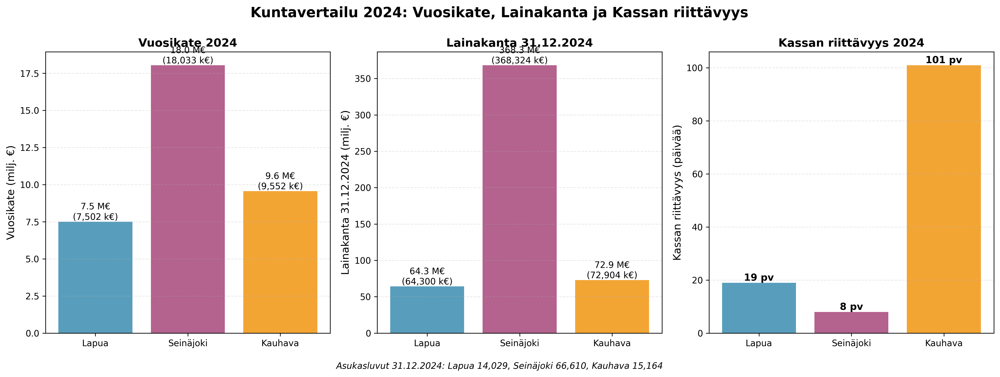

## Kahdeksan päivän kassa ja kolme numeroa, jotka paljastavat kuntatalouden totuuden

Kolme kuntaa, kolme tilinpäätöstä, ja yksi sääntö: mitään ei arvata. Tämä teksti on "helppolukuinen versio" analyysistä, jossa kaikki luvut on muutettu miljooniksi (M) ja asukaslukuun suhteutetuiksi, jotta tavallinen lukija ymmärtää, mitä numerot tarkoittavat.

**Tavoite:** tunnistaa tilinpäätösten perusteella rahankäytön priorisoinnin ja holtittomuuden riskisignaaleja sekä niiden mahdollisia seurauksia **vain siltä osin kuin ne seuraavat suoraan aineistosta**.

**Asukasluvut 31.12.2024:** Lapua 14 029 asukasta, Seinäjoki 66 610 asukasta, Kauhava 15 164 asukasta.[^pop1][^pop2][^pop3]

---

## 1) Mikä numero pysäyttää ensin? Kassapäivät.

Kun kunta elää arkea, se ei elä kauniista Excelistä. Se elää kassasta: montako päivää menot pystyy maksamaan ilman uusia tuloja.

- **Seinäjoki: 8 päivää** (2024).[^1]  
- **Lapua: 19 päivää** (2024).[^2]  
- **Kauhava: 101 päivää** (2024).[^3]  

Tämä ei ole mielipide, vaan tilinpäätöksessä esitetty tunnusluku. Ja jos tämä luku on pieni, pienikin kassavirran heilahdus näkyy nopeasti päätöksenteossa. (Tulkinta perustuu tunnusluvun omaan määritelmään ja tilinpäätöksen rahoituslogiikkaan.)[^4]

**Asukasluku kontekstissa:** Seinäjoen 8 päivän kassa kattaa 66 610 asukkaan kaupungin, kun taas Kauhavan 101 päivän kassa kattaa 15 164 asukkaan kunnan. Koko ei selitä eroa yksin — rahoitusasema on erilainen.[^pop1][^pop2][^pop3]

---

## 2) Toinen numero: investoinnit vs vuosikate — kuka rahoittaa ketä?

Tilinpäätöksissä toistuu sama peruskysymys: riittääkö tulorahoitus (vuosikate) investointeihin, vai täytyykö rahoitus hakea muualta?

**Seinäjoella investointimenot (2024) ovat 41,7 milj. €** ja samaan aikaan **vuosikate (2024) on 18,0 milj. €**.[^5] Tilinpäätös näyttää myös, että **toiminnan ja investointien rahavirta (2024) on -22,8 milj. €**.[^1]  

**Asukasluku kontekstissa:** Seinäjoella 66 610 asukasta, joten investointimenot ovat **626 €/asukas** ja vuosikate **270 €/asukas**. Investointimenot ylittävät vuosikatteen selvästi.[^pop2][^5]

Tämä on tilinpäätöksen kielellä suora "punainen valo": kun toiminnan ja investointien rahavirta on miinuksella, **rahoitusasema joutuu nojaamaan** muihin rahanlähteisiin (velka, kassavarojen purku, myynnit tai muut rahoituserät), koska toiminta + investoinnit eivät tuota nettomääräisesti rahaa.[^1][^6]

Lapua ja Kauhava asettuvat tähän tarinaan eri tavoin:

- **Lapua (14 029 asukasta):** investointimenot (2024) **7,2 milj. €** (**513 €/asukas**) ja **toiminnan ja investointien rahavirta (2024) 0,6 milj. €** (**41 €/asukas**).[^2]  
- **Kauhava (15 164 asukasta):** investointimenot (2024) **12,3 milj. €** (**813 €/asukas**) ja **toiminnan ja investointien rahavirta (2024) -1,3 milj. €** (**-86 €/asukas**).[^3]  

Tässä kohtaa on tärkeää olla rehellinen rajoitteista: tilinpäätös ei kerro investointien "hyötyä" tai "tarpeellisuutta" ilman hankekohtaista aineistoa. Se kertoo rahoitusmekaniikan. (Tämä analyysi pysyy siinä.)[^7]

---

## 3) Kolmas numero: tilikauden tulos — painaako vuosi plussalle vai miinukselle?

Tilikauden tulos ei ole pelkkä otsikko: tilinpäätös itse sanoo, että tulos **lisää tai vähentää omaa pääomaa**.[^8] Se on se kohta, jossa vuosi jättää jäljen.

**Lapua (14 029 asukasta, 2024):** tilikauden tulos **0,6 milj. €** (**45 €/asukas**) ja tilikauden yli-/alijäämä **0,6 milj. €** (**45 €/asukas**).[^9]  

**Seinäjoki (66 610 asukasta, 2024, emokaupunki):** tilikauden tulos **-3,0 milj. €** (**-45 €/asukas**) ja tilikauden ylijäämä/alijäämä **-2,9 milj. €** (**-44 €/asukas**).[^10]  

**Kauhava (15 164 asukasta, 2024):** tilikauden tulos **4,2 milj. €** (**274 €/asukas**) ja tilikauden ylijäämä/alijäämä **4,3 milj. €** (**283 €/asukas**).[^11]

**Vertailu /asukas:** Kauhavalla positiivinen tulos on 274 €/asukas, kun Seinäjoella negatiivinen tulos on -45 €/asukas. Ero on selvä.[^10][^11]

---

## 4) Kolme kuntaa, kolme tarinaa

### 4.1 Lapua: "Tilanne on hallinnassa — mutta teksti varoittaa vuodesta 2025"

Lapuan numerot vuodelta 2024 näyttävät (14 029 asukasta):
- toimintakate **-36,4 milj. €** (**-2 595 €/asukas**)[^9]  
- vuosikate **7,5 milj. €** (**535 €/asukas**)[^9]  
- investointimenot **7,2 milj. €** (**513 €/asukas**)[^2]  
- rahavarat 31.12. **3,4 milj. €** (**244 €/asukas**)[^2]  
- kassapäivät **19**[^2]  
- lainakanta 31.12. **64,3 milj. €** (**4 583 €/asukas**)[^12]

Mutta Lapuan tilinpäätöksen oma teksti kirjoittaa tarinaan seuraavan luvun: se toteaa, että **toiminnan ja investointien rahavirta muuttuu negatiiviseksi** 2025 alkaen ja että se **voi vaatia lisälainoitusta tai menojen leikkauksia**.[^13] Lisäksi sama yhteys liitetään investointitason nousuun ja lainakannan kasvuun.[^13]

Tässä on olennainen ero "tulos on plussalla" vs "rahoitus kestää": Lapua on 2024 ylijäämäinen, mutta kertoo itse rahoituspaineen kasvun mahdollisuudesta tulevina vuosina.[^9][^13]

### 4.2 Seinäjoki: "Sopeutusta tehtiin — mutta investointitaso ja kassa pakottavat kylmään realismiin"

Seinäjoen vuoden 2024 lukujen ydin (emokaupunki, 66 610 asukasta):
- toimintakate **-178,8 milj. €** (**-2 684 €/asukas**)[^10]  
- vuosikate **18,0 milj. €** (**270 €/asukas**)[^10]  
- investointimenot **41,7 milj. €** (**626 €/asukas**)[^1]  
- toiminnan ja investointien rahavirta **-22,8 milj. €** (**-342 €/asukas**)[^1]  
- rahavarat 31.12. **7,2 milj. €** (**108 €/asukas**)[^1]  
- kassapäivät **8**[^1]  
- lainakanta 31.12. **368,3 milj. €** ja **5 530 €/asukas**[^14]

**Vertailu /asukas:** Seinäjoen investointimenot (626 €/asukas) ovat yli kaksinkertaiset vuosikatteeseen (270 €/asukas) nähden. Lainakanta (5 530 €/asukas) on kolmesta kunnasta korkein.[^1][^10][^14]

Seinäjoki raportoi tehneensä ajalla 5–12/2024 **sopeutustoimia**, joiden se sanoo tuoneen noin **8 milj. €** lisäsopeutusta käyttötalouteen ja kytkee tämän toimintakatteen vahvistumiseen.[^15] Samassa aineistossa kaupunki toteaa rakenteellisen talouden **kestävyysvajeen olevan 8 milj. €/vuosi** ja asettaa tavoitteita: vuosikatetason nostaminen nettoinvestointien tasolle sekä investointien määrän alentaminen priorisoimalla ja jaksottamalla.[^16]

Tässä tekstissä ei arvata "miksi näin kävi" tai "mihin rahat menivät" ilman hankekohtaisia päätöksiä. Mutta tilinpäätös antaa jo yhden selkeän signaalin: jos kassapäiviä on 8 ja investointimenot ovat tasoa 41,7 milj. €, rahoitusasema on rakenteellisesti herkkä.[^1][^5]

### 4.3 Kauhava: "Vahva kassa, positiivinen tulos — ja silti oma varoitus investointiohjelmasta"

Kauhavan tilinpäätös antaa 2024 osalta (15 164 asukasta):
- toimintakate **-38,4 milj. €** (**-2 533 €/asukas**)[^11]  
- vuosikate **9,6 milj. €** (**630 €/asukas**)[^11]  
- tilikauden ylijäämä **4,3 milj. €** (**283 €/asukas**)[^11]  
- rahavarat 31.12. **18,9 milj. €** (**1 246 €/asukas**)[^3]  
- kassapäivät **101**[^3]  
- lainakanta 31.12. **72,9 milj. €** ja **4 844 €/asukas**[^17]

**Vertailu /asukas:** Kauhavan rahavarat (1 246 €/asukas) ovat selvästi korkeimmat, ja kassapäivät (101) ovat vahvimmat. Lainakanta (4 844 €/asukas) on Seinäjokea matalampi mutta Lapuaa hieman korkeampi.[^3][^11][^17]

Kauhava myös kirjoittaa suoraan riskisignaalin: se toteaa, että pitkään jatkunut **talouden kantokykyä raskaampi investointiohjelma** kasvattaa lainavastuiden määrää ja että investointitaso on jatkossa pudotettava selvästi poistotasoa pienemmäksi.[^18] Lisäksi tekstissä kuvataan korkotason nousun riskiä ja lainakannan huippua 2025 sekä vuoden 2027 taloussuunnitelman alijäämäisyyttä.[^19]

Tämä tekee Kauhavasta mielenkiintoisen: lyhyen aikavälin maksuvalmius näyttää vahvalta, mutta oma teksti nostaa esiin investointipolun pitkän aikavälin riskin.[^3][^18]

---

## 5) Kylmä vertailu: kolme mittaria, yksi kuva

Tässä kuvaajassa on kolme mittaria (2024), jotka löytyvät kaikista kunnista: **vuosikate (milj. €)**, **lainakanta 31.12. (milj. €)** ja **kassan riittävyys (pv)**.[^1][^2][^3][^10][^11][^14][^17]

**Lukuarvot (2024) ja lähteet:**
- **Vuosikate (milj. €)**: Lapua 7,5 milj. €[^9]; Seinäjoki 18,0 milj. €[^10]; Kauhava 9,6 milj. €[^11].
- **Lainakanta 31.12. (milj. €)**: Lapua 64,3 milj. €[^12]; Seinäjoki 368,3 milj. €[^14]; Kauhava 72,9 milj. €[^17].
- **Kassan riittävyys (pv)**: Lapua 19[^2]; Seinäjoki 8[^1]; Kauhava 101[^3].

---

## 6) Kuntalain "kova reuna": mihin talouden pitää lopulta mahtua?

Tilinpäätös ei ole vain raportti; se on myös osa laissa säädettyä ohjausta:
- **Taloussuunnitelman tulee olla tasapainossa tai ylijäämäinen**, ja alijäämä on katettava määräajassa (110 §).[^20]  
- Tilinpäätöksen tulee antaa **oikea ja riittävä kuva** taloudesta (113 §).[^21]  
- Toimintakertomuksessa on kuvattava tavoitteiden toteutuminen ja olennaiset talousasiat (115 §).[^22]  
- Laissa on kuvattu arviointimenettelyn kriteereitä ja tunnuslukurajoja (118 §).[^23]

Tämä teksti ei tee oikeudellisia johtopäätöksiä siitä, "täyttääkö" kukin kunta jonkin raja-arvon — se vaatisi laajemman, systemaattisen tarkastuksen ja useampia tilikausia. Tässä kuvataan, mitä toimitetusta aineistosta voidaan suoraan sanoa.[^7]

---

## 7) Lopputulema (rank 1–3) — ilman draamaa, mutta ilman selittelyä

Ranking on rakennettu vain neljän kriteerin varaan: tilikauden ylijäämä/alijäämä, kassapäivät, lainakanta €/asukas sekä investointimenot vs vuosikate (riskisignaali).[^1][^2][^3][^9][^10][^11][^14][^17]

1) **Kauhava**: positiivinen tulos (4,3 milj. €, 283 €/asukas) ja selvästi vahvin kassa (101 pv).[^3][^11]  
2) **Lapua**: ylijäämäinen vuosi (0,6 milj. €, 45 €/asukas) ja kassa 19 pv (mutta oma teksti varoittaa 2025 alkaen rahavirran heikkenemisestä).[^2][^9][^13]  
3) **Seinäjoki (emokaupunki)**: alijäämäinen vuosi (-2,9 milj. €, -44 €/asukas), 8 päivän kassa ja korkea lainakanta €/asukas (5 530 €/asukas).[^1][^10][^14]

---

## 8) Lähteet (alaviitteet)

[^pop1]: [Lapua, `out/lapua_2024/Lapua-Tilinpaatos-2024.md`, Page 129, "Asukasluku vuoden 2024 lopussa oli 14.029 Tilastokeskuksen ennakkotietojen"] + [Lapua, `out/lapua_2024/Lapua-Tilinpaatos-2024.md`, Page 865, "Asukasmäärä 31.12. 14 029"]

[^pop2]: [Seinäjoki, `out/seinajoki_2024/Seinäjoki-Tilinpaatos-2024.md`, Page 155, "Seinäjoen asukasluku on nyt historian korkein eli 66 610"] + [Seinäjoki, `out/seinajoki_2024/Seinäjoki-Tilinpaatos-2024.md`, Page 1608-1610, "Vuoden 2024 lopussa asukasluku on 66 610"]

[^pop3]: [Kauhava, `out/kauhava_2024/Kauhava-Tilinpaatos-2024.md`, Page 1288, "Asukasmäärä 15 164 15049"] + [Kauhava, `out/kauhava_2024/Kauhava-Tilinpaatos-2024.md`, Page 2427, "Kunnan asukasmäärä 15 164 15 049,0"]

[^1]: [Seinäjoki, `out/seinajoki_2024/work/page_images/page_0059.png` (printed page 56), "RAHOITUSLASKELMA", "Investointimenot", "Toiminnan ja investointien rahavirta", "Rahavarat 31.12.", "Kassan riittävyys, pv"]

[^2]: [Lapua, `out/lapua_2024/work/page_images/page_0032.png` (printed page 31), "RAHOITUSLASKELMA", "Investointimenot", "Toiminnan ja investointien rahavirta", "Rahavarat 31.12.", "Kassan riittävyys, pv"]

[^3]: [Kauhava, `out/kauhava_2024/work/page_images/page_0033.png` (printed page 32/157), "RAHOITUSLASKELMA JA SEN TUNNUSLUVUT", "Investointimenot", "Toiminnan ja investointien rahavirta", "Rahavarat 31.12.", "Kassan riittävyys, pv"]

[^4]: [Lapua, `out/lapua_2024/work/page_images/page_0032.png` (printed page 31), kaava "Kassan riittävyys (pv) = 365 pv x rahavarat 31.12. / Kassasta maksu tilikaudella"]

[^5]: [Seinäjoki, `out/seinajoki_2024/work/page_images/page_0053.png` (printed page 50), "TULOSLASKELMA (ulkoinen)", "Vuosikate"] + [Seinäjoki, `out/seinajoki_2024/work/page_images/page_0059.png` (printed page 56), "Investointimenot"]

[^6]: [Seinäjoki, `out/seinajoki_2024/work/page_images/page_0059.png` (printed page 56), rahoituslaskelman rakenne: "Toiminnan ja investointien rahavirta"]

[^7]: [Kaikki kunnat, tilinpäätösasiakirjat: analyysin rajaus ja rajoitteet (ei hankekohtaista päätös-/toteuma-aineistoa)]

[^8]: [Seinäjoki, `out/seinajoki_2024/Seinäjoki-Tilinpaatos-2024.md`, Page 62, tekstikappale "Tilikauden tulos ... lisää tai vähentää kaupungin omaa pääomaa."]

[^9]: [Lapua, `out/lapua_2024/work/page_images/page_0028.png` (printed page 27), "TULOSLASKELMA JA SEN TUNNUSLUVUT", "Toimintakate", "Vuosikate", "Tilikauden tulos", "Tilikauden Yli/Alijäämä"]

[^10]: [Seinäjoki, `out/seinajoki_2024/work/page_images/page_0053.png` (printed page 50), "TULOSLASKELMA (ulkoinen)", "Toimintakate", "Vuosikate", "Tilikauden tulos", "Tilikauden ylijäämä (+) tai alijäämä (-)"]

[^11]: [Kauhava, `out/kauhava_2024/work/page_images/page_0030.png` (printed page 29/157), "TULOSLASKELMA JA SEN TUNNUSLUVUT", "Toimintakate", "Vuosikate", "Tilikauden tulos", "Tilikauden ylijäämä tai alijäämä"]

[^12]: [Lapua, `out/lapua_2024/work/page_images/page_0021.png` (printed page 20), "Lainakanta 31.12., 1000€", "Lainat euroa/asukas"]

[^13]: [Lapua, `out/lapua_2024/work/page_images/page_0021.png` (printed page 20), tekstikappale ennen "TALOUSTIEDOT"-taulukkoa: "toiminnan ja investointien rahavirta muuttuu negatiiviseksi ... voi vaatia lisälainoitusta tai menojen leikkauksia" + viittaus lainakannan kasvuun]

[^14]: [Seinäjoki, `out/seinajoki_2024/work/page_images/page_0062.png` (printed page 59), "TASEEN TUNNUSLUVUT", "Lainakanta 31.12., 1 000 €", "Lainakanta 31.12., €/asukas"]

[^15]: [Seinäjoki, `out/seinajoki_2024/Seinäjoki-Tilinpaatos-2024.md`, Page 22, L1087-L1093: sopeutustoimet ~8 milj. € ja yhteys toimintakatteeseen]

[^16]: [Seinäjoki, `out/seinajoki_2024/Seinäjoki-Tilinpaatos-2024.md`, Page 23, L1180-L1194: kestävyysvaje 8 milj. €/vuosi + tavoitteet vuosikate vs nettoinvestoinnit ja investointien priorisointi/jaksotus]

[^17]: [Kauhava, `out/kauhava_2024/work/page_images/page_0035.png` (printed page 34/157), "TASEEN TUNNUSLUVUT", "Lainakanta 31.12., 1000 €", "Lainakanta 31.12., €/as."]

[^18]: [Kauhava, `out/kauhava_2024/Kauhava-Tilinpaatos-2024.md`, Page 24, L990-L994: "kantokykyä raskaampi investointiohjelma" + investointitason pudotustarve]

[^19]: [Kauhava, `out/kauhava_2024/Kauhava-Tilinpaatos-2024.md`, Page 24, L1005-L1011: korkotaso, lainakannan huippu 2025, 2027 taloussuunnitelma alijäämäinen, valtionosuustekijät]

[^20]: [Kuntalaki, `kuntalaki_410-2015_FULL.md`, 110 §, L2393-L2400]

[^21]: [Kuntalaki, `kuntalaki_410-2015_FULL.md`, 113 §, L2427-L2433]

[^22]: [Kuntalaki, `kuntalaki_410-2015_FULL.md`, 115 §, L2445-L2450]

[^23]: [Kuntalaki, `kuntalaki_410-2015_FULL.md`, 118 §, L2465-L2490]

