## “Kahdeksan päivän kassa” ja kaksi muuta numeroa, joista kuntatalous paljastuu

Kolme kuntaa, kolme tilinpäätöstä, ja yksi sääntö: mitään ei arvata. Tämä teksti on “tarinaversio” analyysistä, jossa kaikki luvut ja väitteet on sidottu alaviitteisiin, jotta lukeminen pysyy sujuvana.  

**Tavoite:** tunnistaa tilinpäätösten perusteella rahankäytön priorisoinnin ja holtittomuuden riskisignaaleja sekä niiden mahdollisia seurauksia **vain siltä osin kuin ne seuraavat suoraan aineistosta**.  

---

## 1) Mikä numero pysäyttää ensin? Kassapäivät.

Kun kunta elää arkea, se ei elä kauniista Excelistä. Se elää kassasta: montako päivää menot pystyy maksamaan ilman uusia tuloja.

- **Seinäjoki: 8 päivää** (2024).[^1]  
- **Lapua: 19 päivää** (2024).[^2]  
- **Kauhava: 101 päivää** (2024).[^3]  

Tämä ei ole mielipide, vaan tilinpäätöksessä esitetty tunnusluku. Ja jos tämä luku on pieni, pienikin kassavirran heilahdus näkyy nopeasti päätöksenteossa. (Tulkinta perustuu tunnusluvun omaan määritelmään ja tilinpäätöksen rahoituslogiikkaan.)[^4]

---

## 2) Toinen numero: investoinnit vs vuosikate — kuka rahoittaa ketä?

Tilinpäätöksissä toistuu sama peruskysymys: riittääkö tulorahoitus (vuosikate) investointeihin, vai täytyykö rahoitus hakea muualta?

**Seinäjoella investointimenot (2024) ovat -41 747 (1 000 €)** ja samaan aikaan **vuosikate (2024) on 18 033 (1 000 €)**.[^5] Tilinpäätös näyttää myös, että **toiminnan ja investointien rahavirta (2024) on -22 822 (1 000 €)**.[^1]  

Tämä on tilinpäätöksen kielellä suora “punainen valo”: kun toiminnan ja investointien rahavirta on miinuksella, **rahoitusasema joutuu nojaamaan** muihin rahanlähteisiin (velka, kassavarojen purku, myynnit tai muut rahoituserät), koska toiminta + investoinnit eivät tuota nettomääräisesti rahaa.[^1][^6]

Lapua ja Kauhava asettuvat tähän tarinaan eri tavoin:

- **Lapua:** investointimenot (2024) **-7 179 (1 000 €)** ja **toiminnan ja investointien rahavirta (2024) 572 (1 000 €)**.[^2]  
- **Kauhava:** investointimenot (2024) **12 332 (1 000 €)** ja **toiminnan ja investointien rahavirta (2024) -1 298 (1 000 €)**.[^3]  

Tässä kohtaa on tärkeää olla rehellinen rajoitteista: tilinpäätös ei kerro investointien “hyötyä” tai “tarpeellisuutta” ilman hankekohtaista aineistoa. Se kertoo rahoitusmekaniikan. (Tämä analyysi pysyy siinä.)[^7]

---

## 3) Kolmas numero: tilikauden tulos — painaako vuosi plussalle vai miinukselle?

Tilikauden tulos ei ole pelkkä otsikko: tilinpäätös itse sanoo, että tulos **lisää tai vähentää omaa pääomaa**.[^8] Se on se kohta, jossa vuosi jättää jäljen.

**Lapua (2024):** tilikauden tulos **636 (1 000 €)** ja tilikauden yli-/alijäämä **636 (1 000 €)**.[^9]  
**Seinäjoki (2024, emokaupunki):** tilikauden tulos **-2 973 (1 000 €)** ja tilikauden ylijäämä/alijäämä **-2 939 (1 000 €)**.[^10]  
**Kauhava (2024):** tilikauden tulos **4 162 (1 000 €)** ja tilikauden ylijäämä/alijäämä **4 291 (1 000 €)**.[^11]

---

## 4) Kolme kuntaa, kolme tarinaa

### 4.1 Lapua: “Tilanne on hallinnassa — mutta teksti varoittaa vuodesta 2025”

Lapuan numerot vuodelta 2024 näyttävät:
- toimintakate **-36 402 (1 000 €)**[^9]  
- vuosikate **7 502 (1 000 €)**[^9]  
- investointimenot **-7 179 (1 000 €)**[^2]  
- rahavarat 31.12. **3 422 (1 000 €)**[^2]  
- kassapäivät **19**[^2]  

Mutta Lapuan tilinpäätöksen oma teksti kirjoittaa tarinaan seuraavan luvun: se toteaa, että **toiminnan ja investointien rahavirta muuttuu negatiiviseksi** 2025 alkaen ja että se **voi vaatia lisälainoitusta tai menojen leikkauksia**.[^12] Lisäksi sama yhteys liitetään investointitason nousuun ja lainakannan kasvuun.[^12]

Tässä on olennainen ero “tulos on plussalla” vs “rahoitus kestää”: Lapua on 2024 ylijäämäinen, mutta kertoo itse rahoituspaineen kasvun mahdollisuudesta tulevina vuosina.[^9][^12]

### 4.2 Seinäjoki: “Sopeutusta tehtiin — mutta investointitaso ja kassa pakottavat kylmään realismiin”

Seinäjoen vuoden 2024 lukujen ydin (emokaupunki):
- toimintakate **-178 750 (1 000 €)**[^10]  
- vuosikate **18 033 (1 000 €)**[^10]  
- investointimenot **-41 747 (1 000 €)**[^1]  
- toiminnan ja investointien rahavirta **-22 822 (1 000 €)**[^1]  
- rahavarat 31.12. **7 173 (1 000 €)**[^1]  
- kassapäivät **8**[^1]  
- lainakanta 31.12. **368 324 (1 000 €)** ja €/asukas **5 530**[^13]

Seinäjoki raportoi tehneensä ajalla 5–12/2024 **sopeutustoimia**, joiden se sanoo tuoneen noin **8 milj. €** lisäsopeutusta käyttötalouteen ja kytkee tämän toimintakatteen vahvistumiseen.[^14] Samassa aineistossa kaupunki toteaa rakenteellisen talouden **kestävyysvajeen olevan 8 milj. €/vuosi** ja asettaa tavoitteita: vuosikatetason nostaminen nettoinvestointien tasolle sekä investointien määrän alentaminen priorisoimalla ja jaksottamalla.[^15]

Tässä tekstissä ei arvata “miksi näin kävi” tai “mihin rahat menivät” ilman hankekohtaisia päätöksiä. Mutta tilinpäätös antaa jo yhden selkeän signaalin: jos kassapäiviä on 8 ja investointimenot ovat tasoa -41 747 (1 000 €), rahoitusasema on rakenteellisesti herkkä.[^1][^5]

### 4.3 Kauhava: “Vahva kassa, positiivinen tulos — ja silti oma varoitus investointiohjelmasta”

Kauhavan tilinpäätös antaa 2024 osalta:
- toimintakate **-38 396 (1 000 €)**[^11]  
- vuosikate **9 552 (1 000 €)**[^11]  
- tilikauden ylijäämä **4 291 (1 000 €)**[^11]  
- rahavarat 31.12. **18 895 (1 000 €)**[^3]  
- kassapäivät **101**[^3]  
- lainakanta 31.12. **72 904 (1 000 €)** ja €/asukas **4 844**[^16]

Kauhava myös kirjoittaa suoraan riskisignaalin: se toteaa, että pitkään jatkunut **talouden kantokykyä raskaampi investointiohjelma** kasvattaa lainavastuiden määrää ja että investointitaso on jatkossa pudotettava selvästi poistotasoa pienemmäksi.[^17] Lisäksi tekstissä kuvataan korkotason nousun riskiä ja lainakannan huippua 2025 sekä vuoden 2027 taloussuunnitelman alijäämäisyyttä.[^18]

Tämä tekee Kauhavasta mielenkiintoisen: lyhyen aikavälin maksuvalmius näyttää vahvalta, mutta oma teksti nostaa esiin investointipolun pitkän aikavälin riskin.[^3][^17]

---

## 5) Kylmä vertailu: kolme mittaria, yksi kuva

Tässä kuvaajassa on kolme mittaria (2024), jotka löytyvät kaikista kunnista: **vuosikate**, **lainakanta 31.12.** ja **kassan riittävyys**.[^1][^2][^3][^10][^11][^13][^16]

```mermaid
xychart-beta
  title "Kuntavertailu 2024: vuosikate, lainakanta ja kassan riittävyys"
  x-axis ["Lapua","Seinäjoki","Kauhava"]
  y-axis "Arvo (huom: yksiköt vaihtelevat sarjoittain)" 0 --> 400000
  bar "Vuosikate (1 000 €)" [7502,18033,9552]
  bar "Lainakanta 31.12. (1 000 €)" [64300,368324,72904]
  bar "Kassan riittävyys (pv)" [19,8,101]
```

---

## 6) Kuntalain “kova reuna”: mihin talouden pitää lopulta mahtua?

Tilinpäätös ei ole vain raportti; se on myös osa laissa säädettyä ohjausta:
- **Taloussuunnitelman tulee olla tasapainossa tai ylijäämäinen**, ja alijäämä on katettava määräajassa (110 §).[^19]  
- Tilinpäätöksen tulee antaa **oikea ja riittävä kuva** taloudesta (113 §).[^20]  
- Toimintakertomuksessa on kuvattava tavoitteiden toteutuminen ja olennaiset talousasiat (115 §).[^21]  
- Laissa on kuvattu arviointimenettelyn kriteereitä ja tunnuslukurajoja (118 §).[^22]

Tämä teksti ei tee oikeudellisia johtopäätöksiä siitä, “täyttääkö” kukin kunta jonkin raja-arvon — se vaatisi laajemman, systemaattisen tarkastuksen ja useampia tilikausia. Tässä kuvataan, mitä toimitetusta aineistosta voidaan suoraan sanoa.[^7]

---

## 7) Lopputulema (rank 1–3) — ilman draamaa, mutta ilman selittelyä

Ranking on rakennettu vain neljän kriteerin varaan: tilikauden ylijäämä/alijäämä, kassapäivät, lainakanta €/asukas (tai Lapuan tapauksessa “lainat €/asukas”) sekä investointimenot vs vuosikate (riskisignaali).[^1][^2][^3][^9][^10][^11][^13][^16]

1) **Kauhava**: positiivinen tulos ja selvästi vahvin kassa (101 pv).[^3][^11]  
2) **Lapua**: ylijäämäinen vuosi ja kassa 19 pv (mutta oma teksti varoittaa 2025 alkaen rahavirran heikkenemisestä).[^2][^9][^12]  
3) **Seinäjoki (emokaupunki)**: alijäämäinen vuosi, 8 päivän kassa ja korkea lainakanta €/asukas.[^1][^10][^13]

---

## 8) Lähteet (alaviitteet)

[^1]: [Seinäjoki, `out/seinajoki_2024/work/page_images/page_0059.png` (printed page 56), “RAHOITUSLASKELMA”, “Investointimenot”, “Toiminnan ja investointien rahavirta”, “Rahavarat 31.12.”, “Kassan riittävyys, pv”]
[^2]: [Lapua, `out/lapua_2024/work/page_images/page_0032.png` (printed page 31), “RAHOITUSLASKELMA”, “Investointimenot”, “Toiminnan ja investointien rahavirta”, “Rahavarat 31.12.”, “Kassan riittävyys, pv”]
[^3]: [Kauhava, `out/kauhava_2024/work/page_images/page_0033.png` (printed page 32/157), “RAHOITUSLASKELMA JA SEN TUNNUSLUVUT”, “Investointimenot”, “Toiminnan ja investointien rahavirta”, “Rahavarat 31.12.”, “Kassan riittävyys, pv”]
[^4]: [Lapua, `out/lapua_2024/work/page_images/page_0032.png` (printed page 31), kaava “Kassan riittävyys (pv) = 365 pv x rahavarat 31.12. / Kassasta maksu tilikaudella”]
[^5]: [Seinäjoki, `out/seinajoki_2024/work/page_images/page_0053.png` (printed page 50), “TULOSLASKELMA (ulkoinen)”, “Vuosikate”] + [Seinäjoki, `out/seinajoki_2024/work/page_images/page_0059.png` (printed page 56), “Investointimenot”]
[^6]: [Seinäjoki, `out/seinajoki_2024/work/page_images/page_0059.png` (printed page 56), rahoituslaskelman rakenne: “Toiminnan ja investointien rahavirta”]
[^7]: [Kaikki kunnat, tilinpäätösasiakirjat: analyysin rajaus ja rajoitteet (ei hankekohtaista päätös-/toteuma-aineistoa)]
[^8]: [Seinäjoki, `out/seinajoki_2024/Seinäjoki-Tilinpaatos-2024.md`, Page 62, tekstikappale “Tilikauden tulos ... lisää tai vähentää kaupungin omaa pääomaa.”]
[^9]: [Lapua, `out/lapua_2024/work/page_images/page_0028.png` (printed page 27), “TULOSLASKELMA JA SEN TUNNUSLUVUT”, “Toimintakate”, “Vuosikate”, “Tilikauden tulos”, “Tilikauden Yli/Alijäämä”]
[^10]: [Seinäjoki, `out/seinajoki_2024/work/page_images/page_0053.png` (printed page 50), “TULOSLASKELMA (ulkoinen)”, “Toimintakate”, “Vuosikate”, “Tilikauden tulos”, “Tilikauden ylijäämä (+) tai alijäämä (-)”]
[^11]: [Kauhava, `out/kauhava_2024/work/page_images/page_0030.png` (printed page 29/157), “TULOSLASKELMA JA SEN TUNNUSLUVUT”, “Toimintakate”, “Vuosikate”, “Tilikauden tulos”, “Tilikauden ylijäämä tai alijäämä”]
[^12]: [Lapua, `out/lapua_2024/work/page_images/page_0021.png` (printed page 20), tekstikappale ennen “TALOUSTIEDOT”-taulukkoa: “toiminnan ja investointien rahavirta muuttuu negatiiviseksi ... voi vaatia lisälainoitusta tai menojen leikkauksia” + viittaus lainakannan kasvuun]
[^13]: [Seinäjoki, `out/seinajoki_2024/work/page_images/page_0062.png` (printed page 59), “TASEEN TUNNUSLUVUT”, “Lainakanta 31.12., 1 000 €”, “Lainakanta 31.12., €/asukas”]
[^14]: [Seinäjoki, `out/seinajoki_2024/Seinäjoki-Tilinpaatos-2024.md`, Page 22, L1087-L1093: sopeutustoimet ~8 milj. € ja yhteys toimintakatteeseen]
[^15]: [Seinäjoki, `out/seinajoki_2024/Seinäjoki-Tilinpaatos-2024.md`, Page 23, L1180-L1194: kestävyysvaje 8 milj. €/vuosi + tavoitteet vuosikate vs nettoinvestoinnit ja investointien priorisointi/jaksotus]
[^16]: [Kauhava, `out/kauhava_2024/work/page_images/page_0035.png` (printed page 34/157), “TASEEN TUNNUSLUVUT”, “Lainakanta 31.12., 1000 €”, “Lainakanta 31.12., €/as.”]
[^17]: [Kauhava, `out/kauhava_2024/Kauhava-Tilinpaatos-2024.md`, Page 24, L990-L994: “kantokykyä raskaampi investointiohjelma” + investointitason pudotustarve]
[^18]: [Kauhava, `out/kauhava_2024/Kauhava-Tilinpaatos-2024.md`, Page 24, L1005-L1011: korkotaso, lainakannan huippu 2025, 2027 taloussuunnitelma alijäämäinen, valtionosuustekijät]
[^19]: [Kuntalaki, `kuntalaki_410-2015_FULL.md`, 110 §, L2393-L2400]
[^20]: [Kuntalaki, `kuntalaki_410-2015_FULL.md`, 113 §, L2427-L2433]
[^21]: [Kuntalaki, `kuntalaki_410-2015_FULL.md`, 115 §, L2445-L2450]
[^22]: [Kuntalaki, `kuntalaki_410-2015_FULL.md`, 118 §, L2465-L2490]

